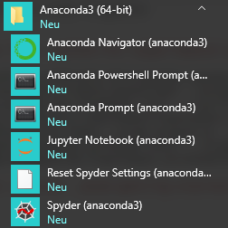
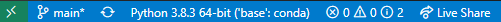

# Getting Started {#getting-started -}

## Installing Anaconda environment {#install-anaconda -}

First, install [Anaconda](https://www.anaconda.com), a Python distribution that includes many packages and tools out-of-the-box, makes it easy to install new packages and keep them updated. Follow this [link](https://www.anaconda.com/products/individual) and download the installer suitable for your platform. You can pick either 32- or 64-bit version. I would recommend the latter, so that we all have maximally similar setup (it won't really make a difference in practice, though). Follow the installer instructions and use defaults, unless you have reasons to modify them (e.g. folder location, as the drive for the default choice may have limited available space, as in my case).

After installation you will have a new _Anaconda3 (64-bit)_ folder that contains links to programs.
```{r echo=FALSE, out.width = "100%", fig.align = 'center'}

```

You can use _Anaconda Navigator_ that allows you to choose a specific programming environment, including [Jupyter Notebook](https://jupyter.org/) that we will use (not JupyterLab, it is more versatile but we want to keep things simple at the beginning!). Alternatively, you can start _Jupyter Notebook_ directly from the start menu. Please read the [online documentation](https://jupyter-notebook.readthedocs.io/en/stable/examples/Notebook/examples_index.html) to familiarize yourself with Jupyter Notebook basic interface, e.g. how to create a new cell, run it, etc.

## Installing Visual Studio Code {#install-vs-code -}
[Visual Studio Code](https://code.visualstudio.com/) is a free lightweight open-source editor with strong support for Python. We will start use it in earnest, once our programs grow to be sufficiently long and complex. At the early stages, we will mostly use Jupyter notebooks and I would recommend using Jupyter notebooks using the default browser-based editor you installed as part of [Anaconda](#install-anaconda). However, you can also work with Jupyter notebooks in VS Code [directly](https://code.visualstudio.com/docs/python/jupyter-support). 

As in case of [Anaconda](#install-anaconda), download the installer for your platform and follow the instructions. Start VS Code and open any Python file, for example [this one](other/empty.py) (use `Alt+click` to download it, ignore warnings, it is has only comments, so cannot harm you). When you open Python file for the first time, VS Code will suggest to install a Python extension. Do that and install a linter when VS Code suggests that ([linting](https://code.visualstudio.com/docs/python/linting) highlights syntactical and stylistic problems in your code, making it easier to write consistent clear code).

Once the Python extension is activated, you will see which Python interpreter is used (you can have more than one or you may have multiple [virtual environments](https://docs.python.org/3/tutorial/venv.html)).

```{r echo=FALSE, out.width = "100%", fig.align = 'center'}

```

If the selected environment is the wrong one or you are simply not sure, click on it and it will open a drop-down list with all interpreters and environments you have. Consult VS Code [online documentation](https://code.visualstudio.com/docs/python/environments) on environments, if you need to change/add/delete environment (the exact settings may change, so looking at constantly updated online documentation is wiser than copying it here).

## Installing PsychoPy {#install-psychopy -}
This step can wait until the first [Memory Game](#memory-game-01) seminar.

Download and install [Standalone PsychoPy](https://www.psychopy.org/download.html) version. You can install PsychoPy as a conda package or via pip. However, using it as a standalone would ensure that you have all necessary additional libraries and a builder interface for the future use. We will use prepackaged PsychoPy's python environment in [VS Code](#install-vs-code).
