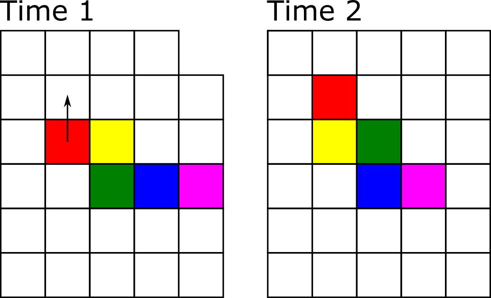

# Snake game {#seminar-02-01}

Welcome back! The purpose of today's seminar to refresh your knowledge of Python acquired previously. We will use dictionaries and lists, as well as conditional statements and loops. Plus, you will need to write functions.^[Sneaky preview: You will start learning about object-oriented programming during our next seminar and  we will turn it into object-based game.]

## Assignments

For this and following projects, use Python IDE of your choice (I would recommend [Visual Studio Code](#install-vs-code)). You still could and should use Jupyter for playing with and testing small code snippets, though. I've added a section on setting up [debugging in VS Code](#debug-in-vs-code) in [Getting Started](#getting-started), take a look once you are ready to run the code.

From now on, create a separate subfolder for each seminar (e.g. _Seminar 01_ for today) and create a separate file (or files, later on) for each exercise^[You can "Save as..." the previous exercise to avoid copy-pasting things by hand.] (e.g., _exercise01.py_, _exercise02.py_, etc.). This is not the most efficient implementation of a version control and will certainly clutter the folder. But it would allow me to see your solutions on every step, which will make it easier for me to comment on them. For submitting the assignment, just zip the folder and upload the zip-file.

## Snake game: an overview

Today, we will program a good old classic: the snake game! The story is simple: you control a snake trying to eat as many apples as you can. Every time you consume an apple, snake's length increases. However, if you hit the wall or bite yourself, the game is over (or you lose one of your lives and game is over once you run out of lives).

Here is how the final product will look like.

```{r, eval=knitr::is_html_output(excludes = "epub"), results = 'asis', echo = F}
cat(
'<div style="text-align:center;"><video controls>
    <source src="videos/snake.m4v" type="video/mp4"> 
  </video></div>'
)
```

As before, we will program the game step by step, starting with an empty gray PsychoPy window. Here is the general outline of how we will proceed:

1. Create boilerplate code to initialize PsychoPy.
2. Figure out how to place a square. We need this because our snake is made of square segments and lives on a rectangular grid made of squares.
3. Create a single segment stationary snake^[Not very exciting, I know. But one has to start somewhere!].
4. Make the snake move assuming a rectangular grid. 
5. Implement "died by hitting a wall".
6. Add apples and make the snake grow.
7. Add check for biting itself (and dying).
8. Add bells-and-whistles to make game look awesome.

As you can see, each new step builds on the previous one. Because of that, remember, do not proceed to the next step until the current one works and you fully(!) understand what each line of code does. Any leftover uncertainty will linger, grow and complicate your life disproportionately!

## Initializing PsychoPy

To remind yourself on how you initialize PsychoPy window, see [here](#seminar08). Let us plan ahead and decide on windows size and its units. Recall that PsychoPy has [five different units](#psychopy-units) for size and position. Given that our snake will be composed of square segments and move on a grid made out of squares, which units should we pick? Read on [units](#psychopy-units) and think which units you would pick before continuing.

---

My suggestion would be `"norm"` units as they make sizing squares easy, as long as we use a suitable aspect ratio. Thus, let us think about the grid. We can define its width and height in _squares_, e.g., a 30 × 20 grid should give us enough space to try things out but we can always increase the resolution of the game later. Create a [constant](#constants) `GRID_SIZE` and assign a [tuple](https://docs.python.org/3/tutorial/datastructures.html#tuples-and-sequences) of `(width, height)` to it. Note that window's aspect ratio will depend on the size of the grid that we pick. If you want to have a square window, use a 30 × 30 grid.

We also need to define an _absolute_ size of a square in pixels (call the constant `SQUARE_SIZE_PIX`), which will determine how large each square will look on the screen and, therefore, will determine the absolute size of the window: $window~height = window~height~in~squares * square~size~in~pixels$ (same goes for the width). Note that this parameter determines how the game looks, double the size of the square in pixels and that will double both width and height of the window. 

Put it all together. You could should look roughly as follows:
```python
# import all libraries and modules you need

# define constants GRID_SIZE and SQUARE_SIZE_PIX

# create PsychoPy window, computing it size in pixels from the two constants

# wait for any key press (just so that window stays on the screen)

# close PsychoPy window
```

Experiment with different grid and square sizes and pick the one that fits your screen.

::: {.infobox .program}
Put your code into _exercise01.py_.
:::

## Adding a square
As I already wrote, our game will be made of squares. Snake is made of squares. Grid it lives on is made of squares. An apple is a square. Which means we need to know the size of that square in the units of the window and we need to know _where_ should each square go in the window, based on its coordinates on the grid.

Computing the size of the square in units of window size is easy, so let us start with it first. If you used `"norm"` units for the PsychoPy window, we know that both its width and its height go from -1 (bottom) to 1 (top). We also know that we have to fit in `GRID_SIZE[0]` squares horizontally and `GRID_SIZE[1]` vertically (recall that `GRID_SIZE` defines the size of our grid in number of squares). Create a new constant `SQUARE_SIZE` that is a _tuple_ and compute square size in units of `"norm"` based on total width/height of the window in the `"norm"` units (not the pixels!) and number of squares we need to fit in horizontally/vertically.

Next, let us create a function that maps a position on the grid to a position in the window. This way, we can think about position of the snake or apples in terms of the grid but draw them in the window coordinates. Create a new file _utilities.py_ and create a function `map_grid_to_win()` that takes a tuple of integers `(x_index, y_index)` with grid position (I called this argument `ipos`) plus a second parameter with a square size (that we just computed) and returns a tuple of floats `(x_pos, y_pos)` with the coordinates of the _center_ of the square in _window_ coordinates. Take a look at the drawing below to see the logic of the computation. The red text show location of red points in _window norm_ units, whereas the black font shows location of a square in _grid index_ units. Note that you need to compute where the _center_ of the square should go.

```{r echo=FALSE}
knitr::include_graphics("images/snake-grid.png")
```

I suggest using Jupyter notebook to create and debug this function and then copying it into _utilities.py_. Remember to document the function following [NumPy docstring format](https://numpydoc.readthedocs.io/en/latest/format.html).

::: {.infobox .program}
Put function map_grid_to_win into _utilities.py_.
:::

Now, test this function by creating a square (you remember which constant defines its size, right?) and placing it at different locations of the grid. Check [here](#seminar08-add-square), if you forgot how to create squares in PsychoPy. Run the code several times, using different grid indexes or adding several squares to check that it work as intended. Your code should look roughly as follows

```python
# import all libraries and modules you need

# import map_grid_to_win function from utilities.py file

# define constants GRID_SIZE and SQUARE_SIZE_PIX
# compute SQUARE_SIZE constant

# create PsychoPy window, computing it size in pixels from the two constants

# create a square (Rect stimulus) with size of SQUARE_SIZE and position computed
#   via grid_to_win function from a pair of grid coordinates

# draw square and flip the window

# wait for any key press (just so that window stays on the screen)

# close PsychoPy window
```

::: {.infobox .program}
Put your code into _exercise02.py_.
:::

## Adding the snake
Now, let us think about how can we represent a snake. It consist of one or more segments. The first one is its head, while the last one is its tail^[A single segment snake is a special case, as its head is also its tail!]. Thus, we can think about it as a [list](https://docs.python.org/3/tutorial/datastructures.html#more-on-lists) of individual segments.

Now let us consider an individual segment. We need to 1) keep track of its location in _grid_ coordinate system and 2) have its visual representation — a square, just like the one you create during the previous exercise  — positioned in _window_ coordinate system. Good news is, you already have a function that maps the former on the latter, so as long as you know where the segment is on the grid, placing its square within the window is easy. As each segment has _two_ pieces of information associated with it, it makes sense to represent it as a [dictionary](https://docs.python.org/3/tutorial/datastructures.html#dictionaries) with two keys: `"pos"` (tuple of x and y in grid coordinates) and `"visuals"` (the square).

To keep code nicely compartmentalized and isolated, add a new function to _utilities.py_ called `create_snake_segment`. It should take three arguments: 

1. a variable with PsychoPy window, which you need to create an square visual.
2. a tuple `(x, y)` with segment position within the grid.
3. a square size, which you need for `map_grid_to_win` function.

It should return a dictionary with `"pos"` and `"visuals"` field, as we agreed upon above.

In the main code, create a variable `snake` that is a list with a single segment in the center of the screen (you need to compute it from `GRID_SIZE` using floor division operator [//](https://python-reference.readthedocs.io/en/latest/docs/operators/floor_division.html)). Instead of drawing a single square one call at a time, as in the previous exercise, you will need to draw all segments of the snake using a _for_ loop^[You don't _really_ need it for a single segment snake we have now but there is no other way to do it later, so let us do it properly from the start]. Here is the outline:

```python
# import all libraries and modules you need

# import map_grid_to_win and create_snake_segment functions from utilities.py file

# define constants GRID_SIZE and SQUARE_SIZE_PIX
# compute SQUARE_SIZE constant

# create PsychoPy window, computing it size in pixels from the two constants

# create the snake variable as a list with a single segment at the center of the screen 


# draw all snake segments using for loop  
# flip the window

# wait for any key press (just so that window stays on the screen)

# close PsychoPy window
```

::: {.infobox .program}
Put function _create_snake_segment_ into _utilities.py_ and your modified code into _exercise03.py_.
:::

## Adding main game loop
Our current game is not _very_ dynamic: it draws the (very small) snake once and waits for a key press before closing the window. Let us add the necessary scaffolding of a main game loop. The game should run [while](https://docs.python.org/3/reference/compound_stmts.html#the-while-statement) variable `gameover` is `False`. Inside the main loop, on each iteration you should draw the snake (and flip the window after that) and check whether participant press `"escape"` key via [event.getKeys()](https://www.psychopy.org/api/event.html#psychopy.event.getKeys). If they did, `gameover` should become `True`.

The code outline is 
```python
# import all libraries and modules you need

# import map_grid_to_win and create_snake_segment functions from utilities.py file

# define constants GRID_SIZE and SQUARE_SIZE_PIX
# compute SQUARE_SIZE constant

# create PsychoPy window, computing it size in pixels from the two constants

# create the snake variable as a list with a single segment at the center of the screen 

# set gameover to False

# while not gameover:
#     draw all snake segments using for loop  
#     flip the window

#     if escape key was pressed:
#         set gameover to True

# close PsychoPy window
```

::: {.infobox .program}
Put your code into _exercise04.py_.
:::

## Get a move on!

Now we need to understand how we will move the snake given that it consist of many segments. Assume that we have a four segment snake that moves up, as in the picture below.
```{r echo=FALSE}

```

Technically, we need to move each segment to a new position. The very first "head" segment moves to the position above the snake. The second segment moves to where the head was before. The third moves into the previous position of the forth one, etc. We _can_ implement movement like that but instead we will utilize the fact that, unless colored as in the figure above, all segments look identical. Look at the uniformly colored snake below. We can "move" it by adding a new segment at a new location (growing a new head at the bity end of the snake, marked as red) and clipping off the last tail segment (marked by the cross), so that the previously penultimate segment becomes the tail. The rest can stay where they are, saving us a lot of hustle when the snake is long!
```{r echo=FALSE}
knitr::include_graphics("images/snake-movement-2.png")
```

In the program, we [list.insert(index, value)](https://docs.python.org/3/tutorial/datastructures.html#more-on-lists)^[We could also have used `dqueue` class from _collections_ library instead of the `list`. It is, essentially, a list that allows appending and poping from the left as well.] the new head segment at index 0 and we remove the tail via [list.pop()](https://docs.python.org/3/tutorial/datastructures.html#more-on-lists).

To keep things neat and tidy, we will implement two functions: `grow_snake()` and `trim_snake()`. Why not combine both actions into a single function? Strategic thinking! Once we add apples to the game, the snake will grow after consuming them by not shedding the tail. Thus, separating these two functions now will simplify our lives later on^[To be honest, I have initially implemented it as a single `move_snake()` function , wrote things up to eating apples, realized the problem, returned and rewrote the notes. So, it is a hindsight type of strategic thinking.].

The `grow_snake()` function should take the following parameters:

1. parameter for the snake itself, which we will modify. To minimize the potential confusion, do not call it `snake` but something (slightly) different, e.g., `the_snake`. This way it will be easier to remember that this is a parameter, not the global vairable.
1. a variable with PsychoPy window, which you need to create a new head segment.
2. a tuple `(x, y)` with _direction of movement_ (call it `dxy` for change in xy coordinates). I.e., it will be `(-1, 0)` for leftward moving snake, `(1, 0)` for right moving, `(-1, 0)` for up, and `(1, 0)` for down.
3. a square size, which you need for `create_snake_segment` function.

Inside the function, you compute the coordinates for the new head segment based on the position of the current head (the very first element of the snake) and the direction of motion, (the third parameter `dxy`,) create a new snake segment at that location (you wrote a function for that!) and insert it before all other elements.

Somewhat counterintuitively, this function does not need to return anything because the snake, which we are passing to it as a first parameter, is a _mutable_ list. Therefore, it is passed _by reference_ and any changes that we apply to it inside the function will affect the global variable itself^[Re-read about [mutable objects](#mutable-objects), if you forgot how it works.].

The `trim_snake()` function is even simpler as it takes the snake as the only parameter and trims its tail. Again, because the snake is a mutable list, you do not need to return anything.

To test these functions, let us create a three-segment long snake at location `(10,9)`, `(11, 9)`, and `(12, 9)` and move it (grow, then trim) upwards every time the player presses `"space"` button. This does not look like a real game but will make it easier to debug, as you can put a break-point to check computation step-by-step. Also note that, eventually, the snake will crawl out of the window but we will worry about this later. Here is the code outline:

```python
# import all libraries and modules you need

# import all functions you need from from utilities.py file

# define constants GRID_SIZE and SQUARE_SIZE_PIX
# compute SQUARE_SIZE constant

# create PsychoPy window, computing it size in pixels from the two constants

# create the snake variable as a list with three segments

# set gameover to False

# while not gameover:
#     draw all snake segments using for loop  
#     flip the window

#     if escape key was pressed:
#         set gameover to True
#     else if the key was "space":
#         move snake up  
#
#
# close PsychoPy window
```

::: {.infobox .program}
Put functions _grow_snake_ and _trim_snake_ into _utilities.py_ and your modified code into _exercise05.py_.
:::

## Self-motion
Our snake should move by itself, not when the player presses _space_ button. For this, we can call `grow_snake()` and `trim_snake()` functions on every iteration of the main game loop. However, by default, when you call `win.flip()` it will synchronize your loop with the refresh rate of the screen (typically, 60 Hz). This means that we would call these functions 60 times per second or, to put it differently, the snake will move 60 squares per second. This is waaaay too fast, given that our original grid size was just 30×20 squares. To appreciate just how fast this is, remove `if key was space:...` conditional statement, and call grow/trim snake functions on every iteration and see the snake fly off the screen.

Instead, we should decide on snake's speed, e.g., 4 squares per second, and define it as a new constant `SNAKE_SPEED`^[Note that speed does not need to be an integer number of squares per second. It can move at 1.5 squares per second, so 3 squares every two seconds.]. From that we can compute a new constant (`SNAKE_TIME_INTERVAL`) that expresses the time interval between calls of grow/trim functions, so that it is called `SNAKE_SPEED` times per second^[Why two constants that express the same information? We could define only the `SNAKE_TIME_INTERVAL` but for a human it makes it harder to understand just how fast the movement will be. In cases like these, I prefer to have two constants, one human-oriented, another computer-oriented. Remember, it is not just about writing a working code, it is about writing a code that is easy for a human to understand.]. For 4 squares/second, that time interval will be 0.25 seconds. Do not hard code it, compute it from `SNAKE_SPEED`!

Now, we just need to use a [clock](https://www.psychopy.org/api/clock.html#psychopy.clock.Clock) or a [countdown timer](https://www.psychopy.org/api/clock.html#psychopy.clock.CountdownTimer)^[They work the same they, it is just a question of whether you start from zero and check whether time is over `SNAKE_TIME_INTERVAL` ([clock](https://www.psychopy.org/api/clock.html#psychopy.clock.Clock)) or you start at `SNAKE_TIME_INTERVAL` and check whether the time ran out/is already negative ([timer](https://www.psychopy.org/api/clock.html#psychopy.clock.CountdownTimer)).] We create it just before the main loop. Inside the loop, we check whether the elapsed time is equal to or greater than `SNAKE_TIME_INTERVAL`. If it is, move the snake and reset the timer. Try setting different speed and see whether the snake moves consistently.

```python
# import all libraries and modules you need

# import all functions you need from from utilities.py file

# define constants GRID_SIZE and SQUARE_SIZE_PIX
# compute SQUARE_SIZE constant
# define SNAKE_SPEED and compute SNAKE_TIME_INTERVAL

# create PsychoPy window, computing it size in pixels from the two constants

# create the snake variable as a list with three segments

# set gameover to False
# create a clock or a countdown timer
# while not gameover:
#     draw all snake segments using for loop  
#     flip the window

#     if escape key was pressed:
#         set gameover to True
#
#     Check whether elapsed time is greater than SNAKE_TIME_INTERVAL, 
#         move snake up and reset clock or countdown timer, if that is the case
#
#
# close PsychoPy window
```

::: {.infobox .program}
Put your code into _exercise06.py_.
:::

## Describing direction using words

In our current design, we describe direction as a tuple `(dx, dy)`. Let us change it, so that it is described using words `"up"`, `"down"`, `"left"`, and `"right"`. This is not strictly necessary but will make our lives somewhat easier later on when we add steering controls. More importantly, it will serve a didactic purpose as well, showing how you can use dictionaries to translate values from one representation to another.

Thus, let us create a new string variable `direction` and set it to `"up"` (or any other direction you like). We will keep the `grow_snake()` function as is and will translate individual strings to pairs of `(dx, dy)` values. E.g., `"up"` corresponds to `(0, -1)`, `"right"` to `(1, 0)`, etc.

We can implement this translation via if-elif conditional statements:
```python
if dir == "up":
  dxy = (0, -1)
elif dir == "right":
  dxy = (1, 0)
  ...
```

However, this approach introduces a lot of repetitive code and does not scale particularly well. Instead, we can use a dictionary (let us call it `DXY` as it is another constant) with `"up"`, `"right"`, etc. string as keys and tuples `(0, -1)`, `(1, 0)`, etc. as values. This way, we can use current value of `dir` variable as a key to get the `(dx, dy)` pair from `DXY` dictionary. Note that you should do it in the function call, **do not** create a temporary variable as in the if-elif examples above.

```python
# import all libraries and modules you need

# import all functions you need from from utilities.py file

# define constants GRID_SIZE and SQUARE_SIZE_PIX
# compute SQUARE_SIZE constant
# define SNAKE_SPEED and compute SNAKE_TIME_INTERVAL

# define DXY dictionary with (dx, dy) entries for each "up", "down", "right",
#     and "left" keys

# create PsychoPy window, computing it size in pixels from the two constants

# create the snake variable as a list with three segments

# initialize direction variable to one of the four directions
# set gameover to False
# create a clock or a countdown timer
# while not gameover:
#     draw all snake segments using for loop  
#     flip the window

#     if escape key was pressed:
#         set gameover to True
#
#     Check whether elapsed time is greater than SNAKE_TIME_INTERVAL, 
#         move snake translating direction variable into (dx, dy) pair from DXY
#         reset clock or countdown timer, if that is the case
#
#
# close PsychoPy window
```

::: {.infobox .program}
Put your code into _exercise07.py_.
:::

## It is all about control
Playing the game would be more fun, if we could steer the snake! If the player presses _right arrow_ key, the snake should turn _clockwise_. Conversely, _left arrow_ key, should turn the snake _counterclockwise_. We need to figure out two things. First, how to determine a new direction of motion given the current one and the key that was pressed. Second, we must decide when and how to change the value of `direction` variable. Let us tackle these problems one at a time.

Determining the new direction of motion is fairly straightforward. If current is `"up"` and key was _right_ (_clockwise_ rotation), the new direction should be `"right"`. If current is `"down"` and key was _left_, the new direction is again `"right"`, etc. You could implement it as a bunch of `if-elif` statements or, better still, use the dictionary look up approach we implemented in the previous exercise. Here, you need a nested dictionary (dictionary inside a dictionary) `NEW_DIRECTION[key][direction]`. The first level has two keys `"left"` and `"right"` (so, effectively, counterclockwise and clockwise rotation) that selects which translation should be used and the second level is the dictionary that translates current direction into the new direction of motion. E.g., if current direction is `"down"` and key was `"right"`, `NEW_DIRECTION["right"]["down"]` should be `"left"` (rotating clockwise from `"down"` gets us to `"left"`). You know how define a simple dictionary. Good news, defining nested dictionaries follows the same rules, so should be straightforward. 

Now let us think about when and how should we change value of `direction` variable. The simplest approach would be to change it as soon as the player presses the key. However, because our snake does not move on every frame this could lead to some odd behavior. Imagine that our game is on "easy" mode, so that the snake moves very slowly (one square per second). In this case, the player could easily press _left_ twice during that second that would make snake move backwards, because  direction was changed by 180°. Snakes, at least our snake, cannot do this. Thus, we need a temporary variable, let us call it `new_direction`, which we will set every time the player presses the key but whose value will be transferred to `direction` only when it is time to move the snake. We will compute it from the current `direction` and the key pressed. This way, even when the player presses _left_ key several times, the snake would still turn only once because we compute the each turn using the same `direction` value but not the changing `new_direction` variable. This also means that players can "change their mind", as the last key press before the snake moves will determine the direction of motion.

```python
# import all libraries and modules you need

# import all functions you need from from utilities.py file

# define constants GRID_SIZE and SQUARE_SIZE_PIX
# compute SQUARE_SIZE constant
# define SNAKE_SPEED and compute SNAKE_TIME_INTERVAL

# define DXY dictionary with (dx, dy) entries for each "up", "down", "right",
#     and "left" keys

# define NEW_DIRECTION nested dictionary

# create PsychoPy window, computing it size in pixels from the two constants

# create the snake variable as a list with three segments

# initialize direction variable to one of the four directions
# initialize new_direction(!!!!) to the same value as direction, why do you need to do this?

# set gameover to False
# create a clock or a countdown timer
# while not gameover:
#     draw all snake segments using for loop  
#     flip the window

#     if escape key was pressed:
#         set gameover to True
#     if key is left or right:
#         set new_direction based on direction and pressed key using NEW_DIRECTION dictionary 
#
#     Check whether elapsed time is greater than SNAKE_TIME_INTERVAL, 
#         set direction to new_direction
#         move snake translating direction variable into (dx, dy) pair from DXY
#         reset clock or countdown timer, if that is the case
#
#
# close PsychoPy window
```

::: {.infobox .program}
Put your code into _exercise08.py_.
:::

## Turning the hard way
Let us implement the same "figure out new direction" code in a more complicated way. The purpose of the exercise is to challenge you, show you new methods of the list, and to demonstrate how you can think about a change of the direction as moving through the list. We won't use this in the main code, so implement it as a function `compute_new_direction(current_direction, pressed_key)`, which  will take two parameters (current direction and pressed key) and will return the new direction of rotation. I strongly recommend writing and debugging code in Jupyter Notebook first and copying it to _utilities.py_ at the very end. Also, do not implement it as a function to begin with. Define parameters as two variable with some preset values and debug the rest of the code.

Here is the idea. Imagine that you have a list `["left", "up", "right", "down"]`. For this list, rotation clockwise would correspond to moving through the list to the right (assuming that you jump to the beginning once you move past the last item). Conversely, rotation counterclockwise corresponds to moving to the left (again, assuming that you jump to the end of the list, once you went past the first item). As you see, rotation is expressed as a very intuitive "motion through the list".

For the actual implementation, first, define a constant list in the order I've described. Next, you need to identify the location of the current direction within the list using [index()](https://docs.python.org/3/tutorial/datastructures.html#more-on-lists) method. Then, you need to figure out whether you increase or decrease that index (to move to the right or to the left), based on `pressed_key` parameter (you can use dictionary approach or a conditional assignment). Finally, you need to control for range, so that index of `-1` becomes `3` (you went too far to the left) and index of `4` should become `0`. The most elegant way to do this, is using `%` [modulus](https://python-reference.readthedocs.io/en/latest/docs/operators/modulus.html) operation. Hint, `4 % 4` is `0`. What about `1 % 4`, `0 % 4`, or even `-1 % 4`? Check it by hand to get an idea of what I am hinting at. And, of course, do not use `4` for division, use the length of the list, as it determines the range of values.

::: {.infobox .program}
Put function compute_new_direction into _utilities.py_.
:::

## To be continued...
We covered a lot of ground today. Next time, we will continue by adding the possibility of killing yourself but also of growing into a longer and cooler snake by eating apples.

