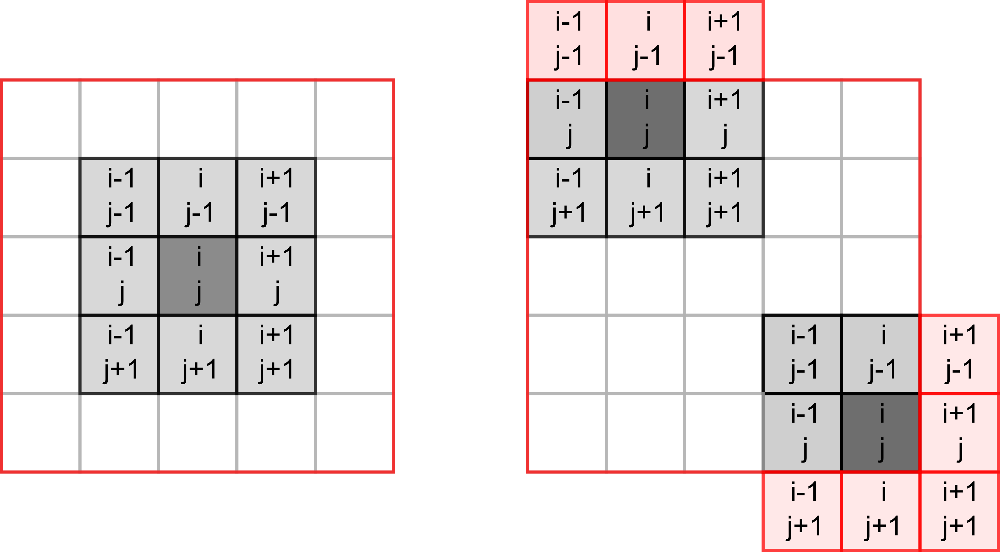

# Game of life in NumPy {#seminar-02-08}

Today you will be programming the [Game of Life](https://en.wikipedia.org/wiki/Conway%27s_Game_of_Life) created by the British mathematician John Horton Conway. This is not really a game but rather a simulation where you set initial conditions up and observe how the population evolves. The rules, [as described on Wikipedia](https://en.wikipedia.org/wiki/Conway%27s_Game_of_Life), are very simple:

1. Any live cell with two or three live neighbours survives.
2. Any dead cell with three live neighbours becomes a live cell.
3. All other live cells die in the next generation. Similarly, all other dead cells stay dead.

Despite simplicity they produce remarkable evolution of a cell culture and give rise to many dynamic or static configurations. Here is an example simulation with a random starting state.

## Implementing  the rules

To program the game, you need to count live neighbours for every cell and use the rules above to decide whether it will be alive or dead on the _next_ iteration. The latter bit is important, you need to evaluate all cells at their current state, you cannot change their status during that period. Accordingly, on each iteration you need to a _new_ cell culture / grid and then overwrite the original one.

Our cells will live in a rectangular world, so you need to count number of neighbours in the 8 cells around it, as shown in the left hand-side image below (index / location of the dot in question is assumed to be _i, j_).

```{r echo=FALSE, fig.align='center'}

```

However, things become slightly trickier, if a cell lies on the _border_ of the world, as depicted on the right hand-side. The same rule for living or dying still apply but when counting neigbours you need to make sure that we do not try to access cells _outside_ of the world (marked in red). If we mess up our indexing, at best we will get an error, at worst we will access wrong elements. E.g., when our index is negative, Python will not issue a mistake but will simply count elements _from the end_. We could, of course, add extra range checks for index values but there is a simpler solution. Think, how can you avoid border indexing issues _without_ explicit range checks?

## NumPy

Our cells live on a 2D grid. In principle, we could implement it as a list of lists. However, to compute the total number of neighbouring cells, we need to make a 2D slice, which is impossible with a list of lists. This is not a deal breaker, as we can emulate this via nested loops, one over horizontal, one over vertical coordinates. However, this would be fairly inefficient. Instead, we can use [NumPy](https://numpy.org/) that provides fast and easy to use implementation of multidimensional arrays, matrix operations, and various functions that re-implement functionality, such as generating random numbers, but for arrays. I will not try to properly cover NumPy here and the material below will contain just the bare minimum that we need for the game. Instead, I encourage you to read the [quickstart guide](quickstart.html) and the [the absolute basics for beginners](https://numpy.org/doc/stable/user/absolute_beginners.html).


The NumPy is not included with the base Python distribution. However, you can easily install it, including versions that utilize special libraries to speed up linear algebra computation. Moreover, PsychoPy Python distribution comes with NumPy, so you should already have it.

As with all libraries, you first need to import it. The traditional way to do this is
```python
import numpy as np
```
You may remember that I advised you against renaming libraries via `as`. However, NumPy and a few other popular and widely used libraries, such as [pandas](https://pandas.pydata.org/) (`as pd`), are exceptions to the rule. This is only because of the tradition / general agreement to consistently rename them to make names shorter. Hence, if you see a code snippet that has `np.` in it, you can be fairly certain that it uses NumPy library imported `as np`. However, you should still double-check, just in case!

## Basic PsychoPy code
To begin with, we need our usual boilerplate for PsychoPy. I recommend that you use [settings file](#settings-files) in combination with the context manager, as you have learned during the previous seminar. This is an overkill for this specific game but it is a good practice. In the settings file, you need just three settings: 

* `grid width`: I've picked a 30
* `grid height`: I've also picked a 30
* `cell size [pix]` : size of an individual cell in pixels. I've picked 10 (so, each cell is 10×10 pixels) but pick the number that is suitable for you.

These three numbers determine the size of the PsychoPy window in pixels (cells will cover the entire window).

::: {.infobox .program}
Implement the boilerplate code, including the main game loop, with the correct window size in  _exercise01.py_.
:::


## Matrix of life
As noted, our cells live on a 2D array called matrix. There are different ways to create it using Python lists but also making a simple array filled with zeros via [np.zeros()](https://numpy.org/doc/stable/reference/generated/numpy.zeros.html), ones via [np.ones()](https://numpy.org/doc/stable/reference/generated/numpy.ones.html)), or [random numbers](https://numpy.org/doc/stable/reference/random/index.html) ^[See [this guide](https://numpy.org/doc/stable/user/absolute_beginners.html#how-to-create-a-basic-array) as well].

To create a 3×3 array filled with zeros, you simply write
```{python}
import numpy as np

x = np.zeros((3, 3))
x
```

However, we do not want to start our game with no living cells (what would happen as per rules above?). Instead, we want a 2D array where a cell is _randomly_ either alive (1) or dead (0). The function that we used for such cases previously was [randint()](https://docs.python.org/3/library/random.html#random.randint) from random library. NumPy has a function with the same name but which returns an array of random integer numbers instead of a single one. Read documentation for [np.random.randint()](https://numpy.org/doc/stable/reference/random/generated/numpy.random.randint.html) function and write a code to generate a 2D 5×3 array filled randomly with 0s and 1s. Hint, you will need to specify the _named_ `size` parameter for this. Experiment with `size` and the highest number parameters.

::: {.infobox .program}
Implement the code in a cell in a Jupyter Notebook.
:::

## From 2D to 3D
State of our cells is represented by a 2D NumPy array but how do we visualize this? We could create a [Rect](https://psychopy.org/api/visual/rect.html#psychopy.visual.rect.Rect) stimulus for each cell and draw them in a loop based on a state of the cell. However, there is a better and faster way to achieve same end by turning a NumPy array into an [ImageStim](https://psychopy.org/api/visual/imagestim.html). You have used it before by supplying a file name to the file but it also accepts a 3D NumPy array of size `[width, height, 3]` that defines the image in the [RGB](https://psychopy.org/general/colours.html#rgb-color-space) or some other [color space](https://psychopy.org/general/colours.html).

Thus, we can take our NumPy array of cells, turn it into an image that spans the entire window, and draw it. However, for this we need a `[grid width, grid height, 3]` array but we only have `[grid width, grid height]`. To get the former, we can just replicate the same array three times and stack it into a 3D representation. The function you need is [np.repeat()](https://numpy.org/doc/stable/reference/generated/numpy.repeat.html), you need to repeat you original array three times along the _third_ axis (`axis=2`, rows are `axis=0`, columns are `axis=1`, so stacking 2D arrays is along the third axis). Experiment with the code looking at what happens when you use other `axis` values or repeat different number of times. Check it visually but also check the `.shape` of the array. 

In addition, for the default RGB color space in PsychoPy values go from -1 (black) to 1 (white). However, in our array we have zeros and ones. Thusm while repeating array, you also need to rescale it, so values go from -1 to 1.

::: {.infobox .program}
Implement the code in a cell in a Jupyter Notebook.
:::

## Drawing cells

Create a new class (I called it `CellCulture`) that will take care of cells. It should be a descendant of the [ImageStim](https://psychopy.org/api/visual/imagestim.html). We need to implement two methods. First, the constructor. It should have a parameter for PsychoPy window (something you definitely need to pass to the ancestor's constructor) and the grid size (either as a tuple or as two width and height parameters, your choice). It should generate a random 2D array (as you already implemented in Jupyter Notebook) and store it in an attribute `cells`. Then, you need to call the ancestor's constructor, passing PsychoPy window and setting size so that the image spans the entire window (what should it size be, given `"normal"` units?). This way, although each cell is a single pixel in the image, we stretch it and turn pixels into squares. Note that you do not need to specify the actual image in the constructor, as we will make a function for that!

The second function should take `.cells` 2D array, turn it into 3D RGB array (you just implemented that code in the Jupyter notebook) and assign it to the `.image` attribute of the class. Call this function `array2img` (or something along these lines) and call it in the constructor _after_ the ancestor constructor was called.

In the main code, create an object of class `CellCulture` and draw it in the main game loop. Currently, it should be a static random patter of black and white squares.

::: {.infobox .program}
Create `CellCulture` class and use it in the main code, drawing the cells. Put code in _exercise02.py_.
:::

## Slicing a 2D array
Slicing for Numpy arrays is more powerful than for lists, see [Indexing and slicing](https://numpy.org/doc/stable/user/absolute_beginners.html#indexing-and-slicing). However, for our intents and purposes, we only need to supply two arrays of indexes, one per each dimension to get the elements that we want.

You can use Python lists
```{python}
x = np.array([[1, 2, 3], [4, 5, 6], [7, 8, 9]])
print(x)
print(x[ (0, 1) , (0, 1)])
```

or you can use NumPy arrays.
```{python}
x = np.array([[1, 2, 3], [4, 5, 6], [7, 8, 9]])
print(x)
print(x[ np.array((0, 1)) , np.array((0, 1))])
```

However, the latter have an advantage that you can apply algebra operations to them such as addition, note the `1 + np.array()`.
```{python}
x = np.array([[1, 2, 3], [4, 5, 6], [7, 8, 9]])
print(x)
print(x[ 1 + np.array((0, 1)) , np.array((0, 1))])
```

To count the neighbours, we need to [sum](https://numpy.org/doc/stable/reference/generated/numpy.sum.html) over eight cells _relative_ to the current one (see the image above). Create two index NumPy arrays that will have correct _relative_ indexes in them, i.e., values should be `-1` and `-1` for the top-left corner, `0` and `-1` for the top-middle cell, etc. Once you have them, you know indexes of all neighbours of a cell _i, j_, as you can simple add them to a corresponding index and center it on that cell. 

In Jupyter notebook, create the _relative_ index of eight neighbours and test it for cells in the 2D array that you created previously. For a moment, use only valid values of `i` and `j` which are _not_ on the border and check that you do extract correct cells and that the total number of neighbours that you compute via  [sum](https://numpy.org/doc/stable/reference/generated/numpy.sum.html) is also correct.

::: {.infobox .program}
Implement relative slicing code in a cell in a Jupyter Notebook.
:::

## Dealing with borders
So, what was your solution to deal with the border problem that I have described above? Mine is to simply pad the cell culture with an extra rows/columns of dead cells. Then, we count neighbours and modify state only of the _inner_ cells (so starting with cells in the second row and column) and keep the outer cells permanently dead. 

To this I create a 2D array of size `[grid width + 2, grid height + 2]` with the outer rows and columns set to zero. One way to do this, is to 

1. Create a `grid width + 2` by `grid height + 2` array of [zeros](https://numpy.org/doc/stable/reference/generated/numpy.zeros.html), 
2. Generate a random array of size `grid width` by `grid height`
3. Put the random (smaller) array into the inner part of the zeros (larger) array using [slicing]((https://numpy.org/doc/stable/user/absolute_beginners.html#indexing-and-slicing)). I.e., just as with Python lists, you can write `1:-1` to slice through each dimension. 

::: {.infobox .program}
In the Jupyter notebook, write the new code that will generate the random cell culture padded with zeros.
:::

Once the code is working, copy it into the constructor of the `CellCulture` class, so that `.cells` array is zero-padded. However, we do not want to show the padding, so also modify the `array2img()` method, so that it repeats not the entire `.cells` array but only the inner part (same slicing!).

::: {.infobox .program}
Update `CellCulture` class by creating a zero-padded initial population and correct array-2-image conversion.
:::

Test the code, use breakpoints if necessary.

## Evolution
Now, let us make cells get born, live, and die. For this, you need to create an `update()` method for the `CellCulture` class. Inside, create a new temporary array `grid width` by `grid height` size, call it `next_gen`. Then, loop through all the cells of the current cell culture _excluding_ the padding, count number of neighbours for each cell, and use [rules above](#seminar-02-08) to determine whether a cell should be dead or alive on the _next_ frame. Put the result into the corresponding in `next_gen`. Once you went through all the cells via nested for loops, copy the `next_gen` into into `.cells` (the same way you copied the initial random state) overwriting the current generation and update the `.image`. In the main experimental code, call `.update()` method on every frame and you should see your cell culture change.

::: {.infobox .program}
Create `update` method in `CellCulture` and use it in the main loop, put it into _exercise03.py_.
:::

## Pause
Add an ability to pause / continue the process via _space_ button. Think how you can implement via a state variable or an attribute of the class.

::: {.infobox .program}
Put the code into _exercise04.py_.
:::

## Drawing
Add an ability to draw/erase cell via mouse. Left mouse button (index `0`) should add a living cell at the location, whereas the right button (index `2`) should put a dead cell. First, create a new method (I called it `set`) that takes x and y index of the cell and its new value (0 or 1) and puts it into the correct position (mind the zero-padding!) in the `.cells`. Next, compute the index of the cell based on the mouse position with the window and the size of the square. Use these coordinates and a button-based value to modify the cell.

::: {.infobox .program}
Create `set` method in `CellCulture`. Use it together with the mouse control in the main loop, put it into _exercise05.py_.
:::


## We want more!
You can always 


